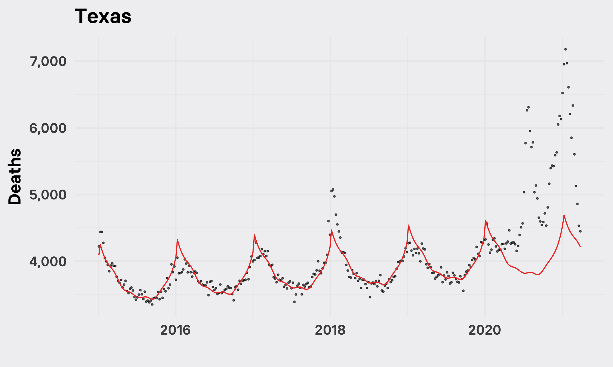
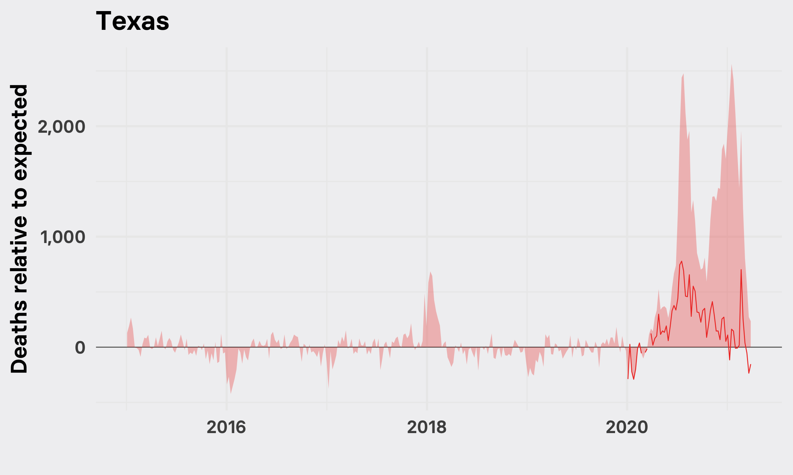
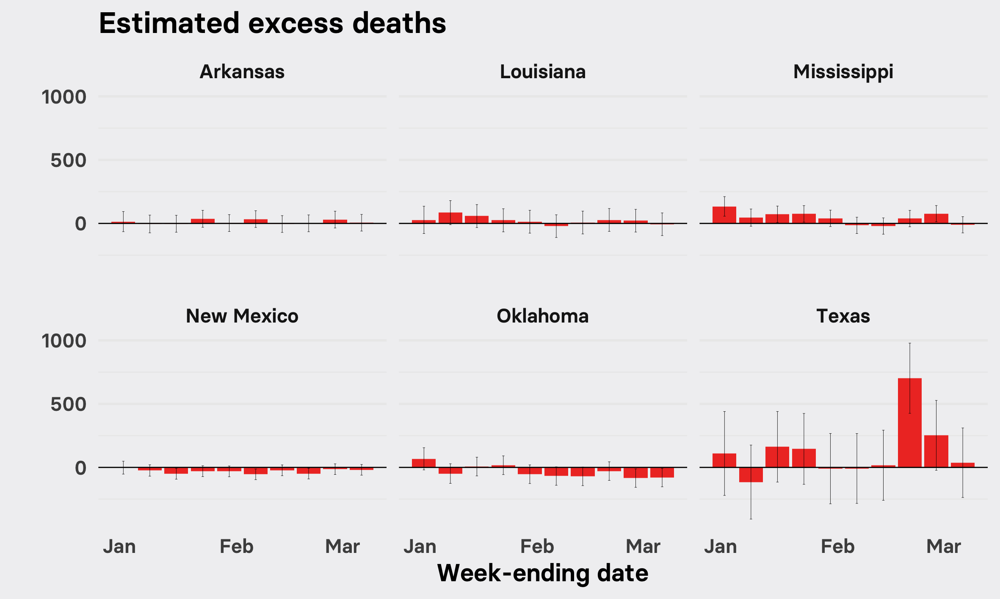
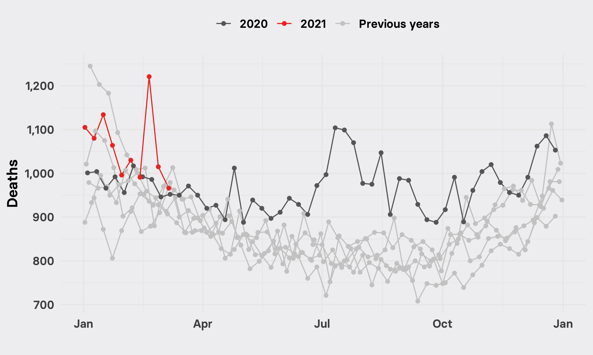
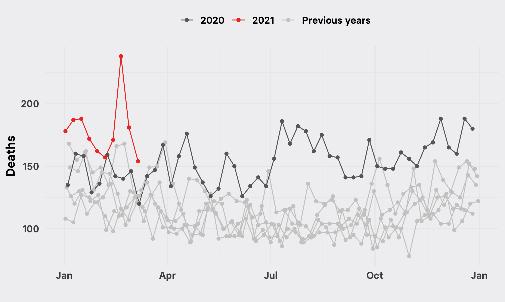
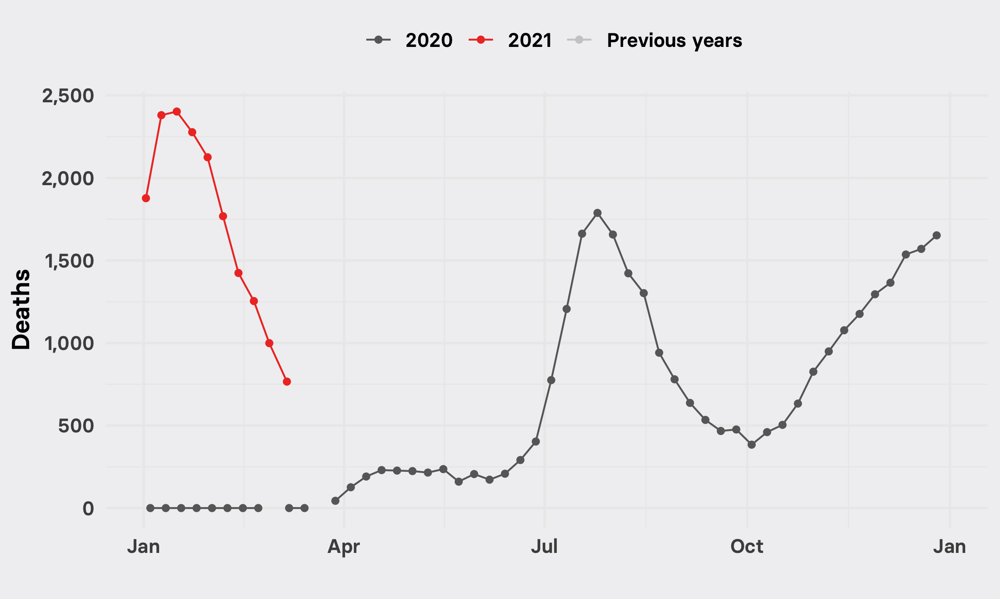
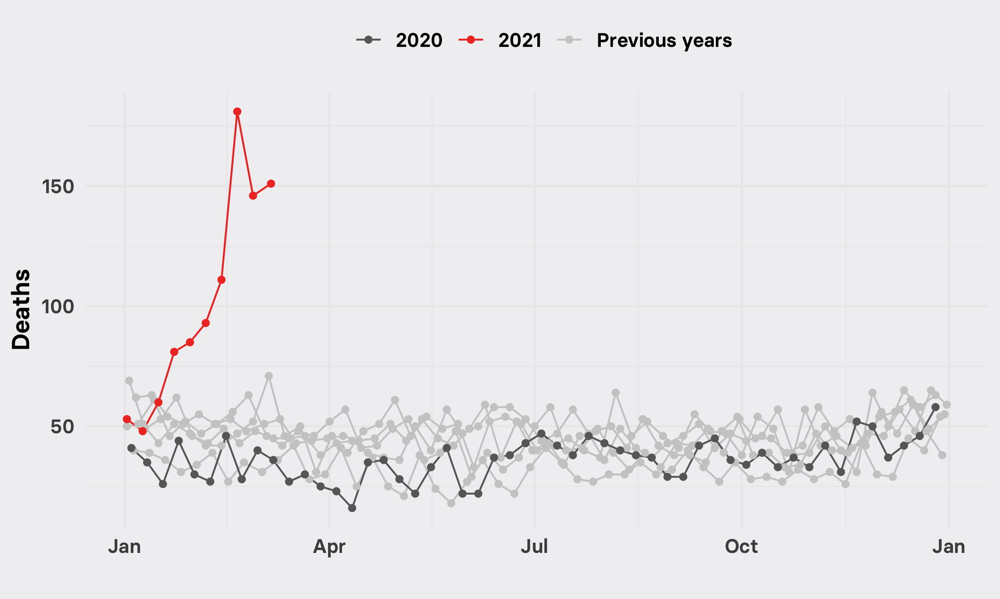
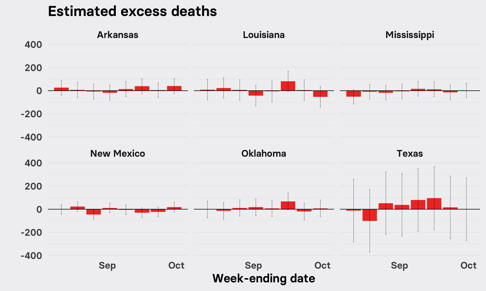
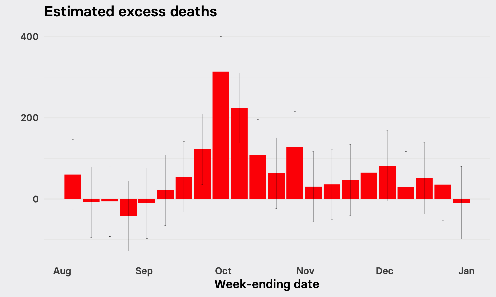

```{r setup, include=FALSE}
knitr::opts_chunk$set(echo = TRUE, warning = FALSE, results = FALSE, message = FALSE)
```

Data and [R](https://www.r-project.org/) code to reproduce the analysis and charts underlying [this May 26, 2021 BuzzFeed News article](https://www.buzzfeednews.com/article/peteraldhous/texas-winter-storm-disaster-deaths) on the excess deaths caused by the February 2021 winter storm and power outages in Texas.

### Data and setting up

The CDC maintains counts of weekly deaths, for all and certain selected causes, at the national and state level (also for New York City, Washington, DC, and Puerto Rico), for [2014 to 2019](https://data.cdc.gov/NCHS/Weekly-Counts-of-Deaths-by-State-and-Select-Causes/3yf8-kanr), and for [2020 and 2021](https://data.cdc.gov/NCHS/Weekly-Counts-of-Deaths-by-State-and-Select-Causes/muzy-jte6). This analysis uses a snapshot of that data captured on May 23, 2021, covering deaths recorded from January 1, 2015, to March 27, 2021. 


```{r}
# load required packages
library(tidyverse)
library(scales)
library(splines)
library(lubridate)

# set system date to UTC
Sys.setenv(TZ="UTC")

# load weekly deaths data
mortality <- read.csv("data/mortality.csv", stringsAsFactors = F) %>%
  mutate(weekendingdate = as.Date(weekendingdate))
```

### Calculating expected deaths

To estimate expected deaths for each jurisdiction and week, we trained models on the 2015-2019 weekly deaths data, accounting for long-term demographic changes using a linear component and using a smoothing spline to account for seasonal variation. This is the same approach used by the [New York Times](https://github.com/nytimes/covid-19-data/tree/master/excess-deaths#expected-deaths) in its [accounting for](https://www.nytimes.com/interactive/2021/01/14/us/covid-19-death-toll.html) excess deaths in the US through the COVID-19 pandemic

```{r}
# data frame to hold observed and expected deaths data
mortality_working <- tibble()

# fit models and predict expected deaths
for (j in unique(mortality$jurisdiction)) {
  tmp1 <- mortality %>%
    filter(jurisdiction == j & weekendingdate < "2020-01-01")
  model <- lm(allcause ~ weekendingdate + bs(mmwrweek, knots = quantile(mmwrweek, seq(0, 1, 0.1))), data = tmp1)
  tmp2 <- mortality %>%
    filter(jurisdiction == j & weekendingdate >= "2020-01-01")
  tmp <- bind_rows(tmp1,tmp2)
  tmp3 <- as_tibble(predict(model,tmp, interval = "prediction"))
  tmp <- bind_cols(tmp,tmp3)
  mortality_working <- bind_rows(mortality_working,tmp)
}

# clean up environment
rm(tmp1,tmp2,tmp3,tmp,model)
```

We then made plots showing actual recorded weekly deaths (points) and the predictions from the model (line) for each jurisdiction.

```{r}
# plots of actual and predicted deaths by jurisdiction
for (j in unique(mortality_working$jurisdiction)) {
  tmp <- mortality_working %>%
    filter(jurisdiction == j)
  plot <- ggplot(tmp) + 
    geom_point(aes(y=allcause, x=weekendingdate), alpha = 0.6, size = 0.5) +
    geom_line(aes(y=fit, x=weekendingdate), color = "#ef3b2c") +
    scale_y_continuous(labels = comma) +
    xlab("") + ylab("Deaths") +
    ggtitle(j) +
    theme_minimal(base_family = "Basier Square SemiBold", base_size = 16) +
    theme(panel.background = element_rect(fill = "#f1f1f2", size = 0),
          plot.background = element_rect(fill = "#f1f1f2", size = 0))
  ggsave(paste0("predictions/",j,".png"), plot, width = 20, height = 12, units = "cm")
}
#clean up environment
rm(j,tmp,plot)
```

Here is the chart for Texas:



There are two large peaks in deaths since the start of 2020 in Texas, which correspond to the summer and fall/winter surges in COVID-19 in the state. Charts for other jurisdictions are in the `predictions` folder.

### Calculating weekly death anomalies

We calculated overall weekly death anomalies and anomalies minus deaths for which COVID-19 was given as the underlying cause.

```{r}
# calculate death anomalies; all causes and excluding COVID-19 deaths
mortality_working <- mortality_working %>%
  mutate(deaths_anomaly = allcause - fit,
         deaths_anomaly_upr = allcause - lwr,
         deaths_anomaly_lwr = allcause - upr,
         non_covid_deaths_anomaly = deaths_anomaly - covid_19_u071_underlying_cause_of_death,
         non_covid_deaths_anomaly_upr = deaths_anomaly_upr - covid_19_u071_underlying_cause_of_death,
         non_covid_deaths_anomaly_lwr = deaths_anomaly_lwr - covid_19_u071_underlying_cause_of_death)
```

We then plotted timelines of the total death anomalies and non-COVID death anomalies for each jurisdiction.

```{r}
# plots of weekly death anomalies by jurisdiction
for (j in unique(mortality_working$jurisdiction)) {
  tmp <- mortality_working %>%
    filter(jurisdiction == j)
  plot <- ggplot(tmp, aes(x = weekendingdate)) + 
    geom_hline(yintercept = 0, size = 0.2) +
    geom_area(aes(y = deaths_anomaly, x = weekendingdate),fill = "#ef3b2c", alpha = 0.3) +
    geom_line(aes(y = non_covid_deaths_anomaly), color = "#ef3b2c", size = 0.3) +
    scale_y_continuous(labels = comma) +
    xlab("") + ylab("Deaths relative to expected") +
    ggtitle(j) +
    theme_minimal(base_family = "Basier Square SemiBold", base_size = 16) +
    theme(panel.background = element_rect(fill = "#f1f1f2", size = 0),
          plot.background = element_rect(fill = "#f1f1f2", size = 0))
  ggsave(paste0("anomalies/",j,".png"), plot, width = 20, height = 12, units = "cm")
}
# clean up environment
rm(tmp,plot)
```

The chart for Texas is below. The shaded area represents weekly death anomalies for all causes. The red line shows anomalies for deaths in which COVID-19 was not identified as the underlying cause. It seems that the under-reporting of deaths associated with COVID-19 was a big problem in the early stages of the pandemic, but reduced significantly in more recent months. 



Charts for other jurisdictions are in the `anomalies` folder. 

### Excess non COVID-19 deaths in the weeks surrounding the winter storm in Texas and neighboring states

We filtered the data for Texas and neighboring states, which were also affected by the February winter storm but did not experience such severe and prolonged power outages, and for weeks in 2021 up to the end of the first week of March.

```{r}
key_states_excess <- mortality_working %>%
  filter(weekendingdate > "2021-01-01" & weekendingdate <= "2021-03-06" & grepl("Texas|Arkansas|Louisiana|Mississippi|Oklahoma|New Mexico",jurisdiction)) %>%
  mutate(weekendingdate = as.Date(weekendingdate))

plot <- ggplot(key_states_excess, aes(x = weekendingdate, y = non_covid_deaths_anomaly)) +
  geom_col(fill = "#ef3b2c") +
  geom_errorbar(aes(x=weekendingdate,
                    ymin=non_covid_deaths_anomaly_lwr,
                    ymax=non_covid_deaths_anomaly_upr),
                size = 0.1,
                width = 0.6) +
  geom_hline(yintercept = 0, size = 0.3) +
  facet_wrap(~jurisdiction) +
  xlab("Week-ending date") +
  ylab("") +
  ggtitle("Estimated excess deaths") +
  scale_x_date(date_labels = "%b", date_breaks = "1 month") +
  theme_minimal(base_family = "Basier Square SemiBold", base_size = 14) +
  theme(panel.background = element_rect(fill = "#f1f1f2", size = 0),
        plot.background = element_rect(fill = "#f1f1f2", size = 0),
        panel.grid.major.x = element_blank(),
        panel.grid.minor.x = element_blank())

ggsave(paste0("img/key_states.png"), plot, width = 20, height = 12, units = "cm")

# clean up environment
rm(plot)
```

The chart below shows the weekly death anomalies from causes other than COVID-19, with error bars based on the 95% confidence intervals for each expected deaths prediction. It shows a significant spike in non-COVID deaths in Texas in the week ending Feb 20, immediately following the winter storm and when the power outages occurred, that greatly exceeds the [official tally](https://www.dshs.state.tx.us/news/updates.shtm#wn) of storm-related deaths being put together by the Texas Department of State Health Services -- which currently stands at 151. Our best estimate is that 702 excess deaths occurred in Texas in the week ending February 20 alone, with a range of uncertainty from 426 to 978.

 

### Texas deaths by week and cause

Next we looked at specific causes of death to see if any particular causes seemed to account for the spike in deaths seen in Texas in the week ending February 20.

```{r}
causes <- mortality_working %>%
  filter(weekendingdate <= "2021-03-06") %>%
  select(jurisdiction, weekendingdate, mmwrweek, 5:17, 32, 34) %>%
  pivot_longer(cols = c(4:18), names_to = "cause", values_to = "deaths") %>%
  # some cleaning and processing of data
  mutate(cause = gsub("_"," ",cause),
         cause = str_squish(gsub("\\w*[0-9]+\\w*\\s*", "", cause)),
         cause = gsub("other diseases of respiratory","other respiratory", cause),
         cause = gsub("symptoms signs and abnormal","other", cause),
         cause = gsub("covid underlying cause of death","covid", cause),
         weekendingdate = as.Date(weekendingdate),
         year = as.character(year(weekendingdate)),
         plot_year = case_when(year == "2021" ~ "2021",
                               year == "2020" ~ "2020",
                               TRUE ~ "Previous years"),
         plot_date = ymd(paste("2021",month(weekendingdate),day(weekendingdate))))

for (j in unique(mortality_working$jurisdiction)) {
  print(j)
  tmp1 <- causes %>%
    filter(jurisdiction == j)
  for (c in unique(tmp1$cause)) {
    tmp2 <- tmp1 %>%
      filter(cause == c)
    plot <- ggplot(tmp2, aes(x= plot_date, y = deaths, group = year, color = plot_year)) +
      geom_line() +
      geom_point() +
      scale_y_continuous(labels = comma) +
      scale_x_date(date_labels = "%b") +
      scale_color_manual(values = c("#686868","#ef3b2c","#cccccc"), name = "") +
      theme_minimal(base_family = "Basier Square SemiBold", base_size = 14) +
      theme(panel.background = element_rect(fill = "#f1f1f2", size = 0),
            plot.background = element_rect(fill = "#f1f1f2", size = 0),
            legend.position = "top") +
      ylab("Deaths") +
      xlab("")
    ggsave(paste0("causes/",c,"_",j,".png"), plot, width = 20, height = 12, units = "cm")
  }
}
```

Two causes of death stood out as having spiked in Texas in the week following the winter storm and during power outages:

### Cardiovascular disease



### Diabetes



### COVID-19

For comparison, here are deaths with COVID-19 as the underlying cause. This reflects the decline from January onward as the fall/winter surge of COVID-19 subsided. 



### Cause not established

Some deaths have not yet been attributed to a cause. It is normal for these numbers to be high for more recent weeks, however there also seems to be a spike in the week following the storm:



### Analysis of previous extreme weather disasters

#### Hurricane Harvey, Texas

We ran a similar analysis for another notable disaster to hit Texas, Hurricane Harvey, which dumped more than 40 inches of rain on parts of the Houston area in August and September 2017. Just over 100 people are thought to have been killed in Texas by Harvey, 68 of them killed directly by the storm, according to the [National Hurricane Center](https://www.nhc.noaa.gov/data/tcr/AL092017_Harvey.pdf). 

```{r}
key_states_excess_harvey <- mortality_working %>%
  filter(weekendingdate > "2017-08-05" & weekendingdate <= "2017-09-30" & grepl("Texas|Arkansas|Louisiana|Mississippi|Oklahoma|New Mexico",jurisdiction)) %>%
  mutate(weekendingdate = as.Date(weekendingdate))

plot <- ggplot(key_states_excess_harvey, aes(x = weekendingdate, y = deaths_anomaly)) +
  geom_col(fill = "#ef3b2c") +
  geom_errorbar(aes(x=weekendingdate,
                    ymin=deaths_anomaly_lwr,
                    ymax=deaths_anomaly_upr),
                size = 0.1,
                width = 0.6) +
  geom_hline(yintercept = 0, size = 0.3) +
  facet_wrap(~jurisdiction) +
  xlab("Week-ending date") +
  ylab("") +
  ggtitle("Estimated excess deaths") +
  scale_x_date(date_labels = "%b", date_breaks = "1 month") +
  theme_minimal(base_family = "Basier Square SemiBold", base_size = 14) +
  theme(panel.background = element_rect(fill = "#f1f1f2", size = 0),
        plot.background = element_rect(fill = "#f1f1f2", size = 0),
        panel.grid.major.x = element_blank(),
        panel.grid.minor.x = element_blank())

ggsave(paste0("img/key_states_harvey.png"), plot, width = 20, height = 12, units = "cm")

```

We did not see a clear excess deaths signal for this storm.



#### Hurricane Maria, Puerto Rico

Hurricane Maria hit the island on Sept. 20, 2017, causing extensive and prolonged power outages.

```{r}
pr_excess_maria <- mortality_working %>%
  filter(weekendingdate > "2017-08-01" & weekendingdate <= "2018-01-01" & grepl("Puerto",jurisdiction)) %>%
  mutate(weekendingdate = as.Date(weekendingdate))

plot <- ggplot(pr_excess_maria, aes(x = weekendingdate, y = deaths_anomaly)) +
  geom_col(fill = "red") +
  geom_errorbar(aes(x = weekendingdate,
                    ymin = deaths_anomaly_lwr,
                    ymax = deaths_anomaly_upr),
                size = 0.1,
                width = 0.6) +
  geom_hline(yintercept = 0, size = 0.3) +
  xlab("Week-ending date") +
  ylab("") +
  ggtitle("Estimated excess deaths") +
  scale_x_date(date_labels = "%b", date_breaks = "1 month") +
  theme_minimal(base_family = "Basier Square SemiBold", base_size = 14) +
  theme(panel.background = element_rect(fill = "#f1f1f2", size = 0),
        plot.background = element_rect(fill = "#f1f1f2", size = 0),
        panel.grid.major.x = element_blank(),
        panel.grid.minor.x = element_blank())

ggsave(paste0("img/pr_maria.png"), plot, width = 20, height = 12, units = "cm")

maria_estimate <- pr_excess_maria %>%
  filter(weekendingdate >= "2017-09-23" & weekendingdate <= "2017-10-28") %>%
  summarize(deaths_anomaly = sum(deaths_anomaly))

```

In this case there was a clear excess deaths signal. Our best estimate of the excess deaths from Hurricane Maria for the weeks ending Sept. 23, 2017 to Oct. 28, 2017, is 961. In [this piece](https://www.nytimes.com/interactive/2017/12/08/us/puerto-rico-hurricane-maria-death-toll.html), covering the period Sept. 20 to Oct. 31 and using data from Puerto Rico’s vital statistics bureau, the New York Times estimated 1,052. A [study](http://prstudy.publichealth.gwu.edu/sites/prstudy.publichealth.gwu.edu/files/reports/Acertainment%20of%20the%20Estimated%20Excess%20Mortality%20from%20Hurricane%20Maria%20in%20Puerto%20Rico.pdf) from researchers at George Washington University, covering a longer period up to February 2018, estimated that 2,975 people were killed by the storm and power outages.



### Acknowledgments

Thanks to Magali Barbieri of the University of California at Berkeley, Steven Woolf and colleagues at Virginia Commonwealth University, and Ariel Karlinksy of the Hebrew University of Jerusalem, for reviewing this analysis and providing helpful advice.
